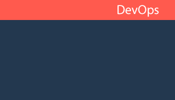
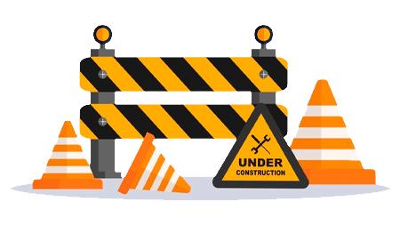

<h1 align="center">Bem-vindo ao Git 📂 </h1>

  Me chamo Gustavo, mas pode me chamar de Gus. Sou DevOps Engineer!

    DevOps Engineer na Esfera Fidelidade, o programa de benefícios do grupo Santander. Formado Em gestão de TI pela universidade FATEC e atualmente cursando Engenharia da computação pela UAM. Atuo com tecnologias de ponta como AWS, Kubernetes, Docker, Terraform... Além de ênfase em desenvolvimento mobile Flutter/ReactNative e Web via ReactJs e todo o ecossistema Javascript. Paixão por engenharia de áudio e Baixista nas horas vagas.

  Podemos conversar sobre:

 

<h1 align="center">Meu momento de carreira 📍 </h1>

  Atualmente, sou Site Reliability Engineer (SRE) na Esfera, onde trabalho para garantir que os sistemas da empresa sejam rápidos, confiáveis e sempre disponíveis. Nos últimos 8 meses, venho utilizando ferramentas como GitLab e CI/CD para automatizar e otimizar processos, sempre buscando melhorar a performance e a estabilidade dos nossos sistemas.

  Antes de atuar como SRE, passei mais de 2 anos como Frontend Developer na mesma empresa, trabalhando com CSS, Salesforce e outras tecnologias para criar interfaces de usuário que fossem ao mesmo tempo bonitas e funcionais com foco em EMKTS e LPs. Meu foco era sempre garantir uma experiência de usuário fluida e integrar os sistemas de forma eficiente.

  Minha trajetória mistura o desenvolvimento de sistemas e a garantia de que eles funcionem de forma estável e escalável. Estou sempre em busca de aprender mais e enfrentar novos desafios, seja no desenvolvimento de interfaces ou na manutenção da infraestrutura de TI.

<h1 align="center">Meus objetivos 🚩 </h1>

  Meus objetivos na carreira são focados em me tornar cada vez mais proficiente em Kubernetes e em continuar aprendendo sobre infraestrutura em nuvem. Tenho lidado com uma série de desafios técnicos, como garantir a escalabilidade e a estabilidade dos sistemas, e estou sempre buscando soluções práticas e eficientes para resolver problemas complexos.

Estou também investindo em certificações como AWS e Terraform, para aprofundar meu conhecimento e aplicar as melhores práticas no dia a dia. Meu objetivo é continuar desenvolvendo minhas habilidades para criar e manter sistemas robustos, escaláveis e automatizados.

Busco constantemente novos desafios que me permitam crescer profissionalmente e contribuir para a evolução das infraestruturas e operações das empresas em que trabalho.

<h1 align="center">Acompanhe meu progresso 🌱 </h1>

<table align="center">
  <tr>
    <td style="border: none">
        

    </td>
    <td style="border: none">&nbsp;
        
&nbsp;

    </td>
  </tr>
</table>

<h1 align="center">Projetos em Destaque | DEVOPS | 🚀 </h1>

Tenho alguns projetos no meu GitHub focados em DevOps e Site Reliability Engineering (SRE), que abordam práticas de automação, monitoramento e otimização de infraestruturas. Um dos principais projetos é a Automação de Deploy com Docker e Kubernetes, que facilita o gerenciamento de ambientes em produção. Também trabalho em uma pipeline CI/CD usando GitLab, permitindo integrações contínuas e entregas rápidas. Outro projeto interessante é a Gestão de Logs e Monitoramento com ferramentas como Prometheus e Grafana, garantindo alta disponibilidade e resiliência dos sistemas. Esses projetos têm como objetivo melhorar a eficiência operacional e garantir que as aplicações sejam escaláveis e resilientes.

 

    

 

O terraform foi uma das tecnologias na area de DevOps que mais me fez me apaixonar por essa cultura e mentalidade. Aqui criei alguns projetos reais nas quais já atuei e projetos que me desafiei a criar me propondo casas na qual a IaC (Infra como Código) seria de grande ajuda. 

 

 
<table align="center" border="0" width="100%">
  <tr>
    <td style="border: none" width="33%">
    

        
    

      
      
<b>VM EC2 on AWS</b> Provisionamento de uma VM simples na AWS com configurações de VPC adequadas.

    </td>
    <td style="border: none" width="33%">
    

    

      
      
<b>Amazon Comprehend</b> Provisionamento de uma infra para treinamento de IA para Amazon Comprehend. 

    </td>
    <td style="border: none" width="33%">
    

    

      
      
<b>Amazon Textract</b> Provisionamento de um fluxo de extração de textos de documentos com IA.

    </td>
  </tr>
</table>

[**Ver mais projetos**](https://github.com/gussXX)

 

    

 

Alguns projetos desenvolvidos em Python, aqui busquei desenvolver projetos voltados para minha area de atuação de forma mais especifica, como por exemplo automações mais eficientes em Pipelines e afins, bem como automações Web.

 

 
<table align="center" border="0" width="100%">
  <tr>
    <td style="border: none" width="33%">
    

        
    

      
    
<b>Automação com Selenium</b> Um projeto que utiliza Python para automatizar tarefas repetitivas na Web.

    </td>
    <td style="border: none" width="33%">
    

    

      
      
<b>Web Scraping</b> Desenvolvendo uma rotina de scraping para alimentar uma base de dados.

    </td>
    <td style="border: none" width="33%">
    

    

      
      
<b>Pipeline com Python</b> Desenvolvimento de build, test e deploy utilizando o python.

    </td>
  </tr>
</table>

[**Ver mais projetos**](https://github.com/gussXX)

<h1 align="center">Projetos em Destaque | BACKEND | 🚀 </h1>

Mesmo sendo um amante de frontend, aplicações de backend me proporcionam desafios que facilmente encontro no meu dia a dia no trabalho, saber como desenvolver aplicações me ajudam a entender e poder lidar melhor com problemas reais, bem como consumir APIs publicas e padrões de desenvolvimento.

 

    

 
<table align="center" border="0">
  <tr>
    <td style="border: none">
    

        
    

      
      
<b>API Rest</b> Desevolvimento de uma API generica para demonstração de rotas.

    </td>
    <td style="border: none">
    

    

      
      
<b>Chat com socket.IO</b> Desenvolvimento de uma API para chat em tempo real.

    </td>
    <td style="border: none">
    

    

      
      
<b>Monitoramento de logs</b> Desenvolvimento de um sistema que minitora logs e os agrupa.

    </td>
  </tr>
</table>

[**Ver mais projetos**](https://github.com/gussXX)

 

 

<h1 align="center">Esse perfil ainda está em construção ⚠️ </h1>

    
     
    Dicas construtivas são sempre bem vindas! e eu adoraria colaborar com algum projeto que minhas habilidades sejam uteis e possam agregar!
     
    vamos bater um papo!

  
    
        

<!-- <h1 align="center">Projetos em Destaque | MOBILE | 🚀 </h1>

Sou apaixonado por Flutter e seu potencial para o desenvolvimento multiplataforma. Com o Flutter, consigo criar aplicações móveis nativas para Android e iOS a partir de uma única base de código, o que economiza tempo e recursos. A flexibilidade do framework e a facilidade de integração com APIs tornam o processo de desenvolvimento mais ágil e eficiente, permitindo que eu entregue aplicativos de alta qualidade para diferentes plataformas com menos esforço.

 

    

 
<table align="center" border="0">
  <tr>
    <td style="border: none">
    

        
    

      
      
<b>Projeto</b> is simply dummy text of the printing and typesetting industry.

    </td>
    <td style="border: none">
    

    

      
      
<b>Projeto</b> is simply dummy text of the printing and typesetting industry. 

    </td>
    <td style="border: none">
    

    

      
      
<b>Projeto</b> is simply dummy text of the printing and typesetting industry.

    </td>
  </tr>
</table>

[**Ver mais projetos**](https://github.com/gussXX)

 

<h1 align="center">Projetos em Destaque | FRONTEND | 🚀 </h1>

Tenho grande interesse no desenvolvimento de frontend web, especialmente com React.js. A capacidade do React de criar interfaces dinâmicas e reutilizáveis facilita o desenvolvimento de aplicações rápidas e escaláveis.

 

    

 
<table align="center" border="0">
  <tr>
    <td style="border: none">
    

        
    

      
      
<b>Projeto</b> is simply dummy text of the printing and typesetting industry.

    </td>
    <td style="border: none">
    

    

      
      
<b>Projeto</b> is simply dummy text of the printing and typesetting industry. 

    </td>
    <td style="border: none">
    

    

      
      
<b>Projeto</b> is simply dummy text of the printing and typesetting industry.

    </td>
  </tr>
</table> -->

<!-- 

    

    

    

    

    

    

 -->

<!--
**gussXX/gussXX** is a ✨ _special_ ✨ repository because its `README.md` (this file) appears on your GitHub profile.

Here are some ideas to get you started:

- 🔭 I’m currently working on ...
- 🌱 I’m currently learning ...
- 👯 I’m looking to collaborate on ...
- 🤔 I’m looking for help with ...
- 💬 Ask me about ...
- 📫 How to reach me: ...
- 😄 Pronouns: ...
- ⚡ Fun fact: ...
-->
