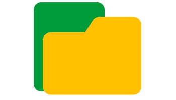

<h1 align="center">Bem-vindo ao Git 📂 </h1>

  Me chamo Gustavo, mas pode me chamar de Gus. Sou DevOps Engineer!

    DevOps Engineer na Esfera Fidelidade, o programa de benefícios do grupo Santander. Formado Em gestão de TI pela universidade FATEC e atualmente cursando Engenharia da computação pela UAM. Atuo com tecnologias de ponta como AWS, Kubernetes, Docker, Terraform... Além de ênfase em desenvolvimento mobile Flutter/ReactNative e Web via ReactJs e todo o ecossistema Javascript. Paixão por engenharia de áudio e Baixista nas horas vagas.

<h1 align="center">Acompanhe meu progresso 🌱 </h1>

<table align="center">
  <tr>
    <td style="border: none">
        

    </td>
    <td style="border: none">&nbsp;
        
&nbsp;

    </td>
  </tr>
</table>

<h1 align="center">Projetos em Destaque | DEVOPS | 🚀 </h1>

Tenho alguns projetos no meu GitHub focados em DevOps e Site Reliability Engineering (SRE), que abordam práticas de automação, monitoramento e otimização de infraestruturas. Um dos principais projetos é a Automação de Deploy com Docker e Kubernetes, que facilita o gerenciamento de ambientes em produção. Também trabalho em uma pipeline CI/CD usando GitLab, permitindo integrações contínuas e entregas rápidas. Outro projeto interessante é a Gestão de Logs e Monitoramento com ferramentas como Prometheus e Grafana, garantindo alta disponibilidade e resiliência dos sistemas. Esses projetos têm como objetivo melhorar a eficiência operacional e garantir que as aplicações sejam escaláveis e resilientes.

 

    

 
<table align="center" border="0">
  <tr>
    <td style="border: none">
    

        
    

      
      
<b>Projeto 01</b> is simply dummy text of the printing and typesetting industry.

    </td>
    <td style="border: none">
    

    

      
      
<b>Projeto 01</b> is simply dummy text of the printing and typesetting industry. 

    </td>
    <td style="border: none">
    

    

      
      
<b>Projeto 01</b> is simply dummy text of the printing and typesetting industry.

    </td>
  </tr>
</table>

[**Ver mais projetos**](https://your-link.com)

 

<h1 align="center">Projetos em Destaque | BACKEND | 🚀 </h1>

No meu GitHub, você encontrará diversos projetos de backend, com foco principal em Node.js. Acredito que um bom profissional de DevOps também deve saber desenvolver aplicações, pois isso permite uma integração mais eficiente entre o desenvolvimento e a infraestrutura. Meus projetos em Node.js incluem APIs RESTful e automações para otimizar processos, alinhando-se às práticas de CI/CD e garantindo a entrega contínua e segura.

 

    

 
<table align="center" border="0">
  <tr>
    <td style="border: none">
    

        
    

      
      
<b>Projeto 01</b> is simply dummy text of the printing and typesetting industry.

    </td>
    <td style="border: none">
    

    

      
      
<b>Projeto 01</b> is simply dummy text of the printing and typesetting industry. 

    </td>
    <td style="border: none">
    

    

      
      
<b>Projeto 01</b> is simply dummy text of the printing and typesetting industry.

    </td>
  </tr>
</table>

[**Ver mais projetos**](https://your-link.com)

 

<h1 align="center">Projetos em Destaque | MOBILE | 🚀 </h1>

Sou apaixonado por Flutter e seu potencial para o desenvolvimento multiplataforma. Com o Flutter, consigo criar aplicações móveis nativas para Android e iOS a partir de uma única base de código, o que economiza tempo e recursos. A flexibilidade do framework e a facilidade de integração com APIs tornam o processo de desenvolvimento mais ágil e eficiente, permitindo que eu entregue aplicativos de alta qualidade para diferentes plataformas com menos esforço.

 

    

 
<table align="center" border="0">
  <tr>
    <td style="border: none">
    

        
    

      
      
<b>Projeto 01</b> is simply dummy text of the printing and typesetting industry.

    </td>
    <td style="border: none">
    

    

      
      
<b>Projeto 01</b> is simply dummy text of the printing and typesetting industry. 

    </td>
    <td style="border: none">
    

    

      
      
<b>Projeto 01</b> is simply dummy text of the printing and typesetting industry.

    </td>
  </tr>
</table>

[**Ver mais projetos**](https://your-link.com)

 

<h1 align="center">Projetos em Destaque | FRONTEND | 🚀 </h1>

Tenho grande interesse no desenvolvimento de frontend web, especialmente com React.js. A capacidade do React de criar interfaces dinâmicas e reutilizáveis facilita o desenvolvimento de aplicações rápidas e escaláveis.

 

    

 
<table align="center" border="0">
  <tr>
    <td style="border: none">
    

        
    

      
      
<b>Projeto 01</b> is simply dummy text of the printing and typesetting industry.

    </td>
    <td style="border: none">
    

    

      
      
<b>Projeto 01</b> is simply dummy text of the printing and typesetting industry. 

    </td>
    <td style="border: none">
    

    

      
      
<b>Projeto 01</b> is simply dummy text of the printing and typesetting industry.

    </td>
  </tr>
</table>

<!-- 

    

    

    

    

    

    

 -->

<!--
**gussXX/gussXX** is a ✨ _special_ ✨ repository because its `README.md` (this file) appears on your GitHub profile.

Here are some ideas to get you started:

- 🔭 I’m currently working on ...
- 🌱 I’m currently learning ...
- 👯 I’m looking to collaborate on ...
- 🤔 I’m looking for help with ...
- 💬 Ask me about ...
- 📫 How to reach me: ...
- 😄 Pronouns: ...
- ⚡ Fun fact: ...
-->
